🚀 AI Log Analyzer (Azure + Ollama)  

Automated cloud observability solution that analyzes production logs and generates structured insights using a local AI model.  

---------------------------------------------------------------------------------------------------------------------------------------------------------------------------------------

📌 Overview

This project simulates a real-world cloud support scenario where production logs are analyzed to:

- Detect recurring errors and failures  
- Identify root causes  
- Recommend actionable fixes  

The system integrates Azure services with a local LLM (Ollama) to automate log analysis and improve incident response efficiency.

---------------------------------------------------------------------------------------------------------------------------------------------------------------------------------------

🏗 Architecture

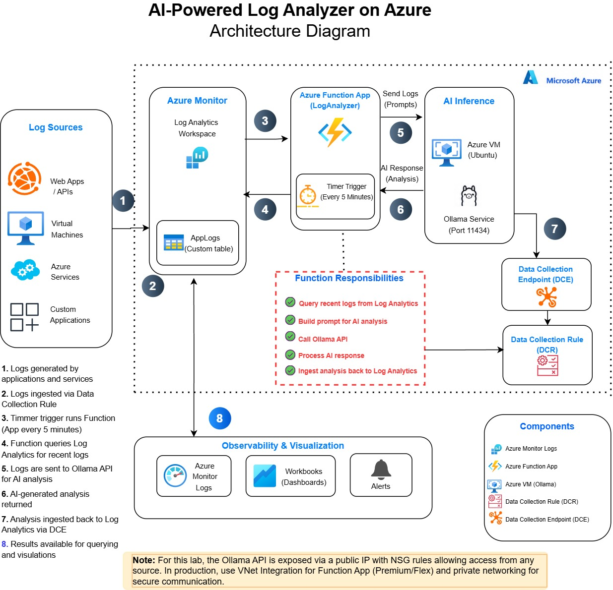  

---------------------------------------------------------------------------------------------------------------------------------------------------------------------------------------

⚙️ How It Works  

1. Azure Function (Timer Trigger) runs every 5 minutes  
2. Queries logs from Azure Log Analytics (KQL)  
3. Sends logs to Ollama API (running on VM)  
4. AI model analyzes logs and generates structured output  
5. Results are written back to Log Analytics (custom table)  

---------------------------------------------------------------------------------------------------------------------------------------------------------------------------------------

📊 End-to-End Flow (Proof)  

Azure Resources Overview

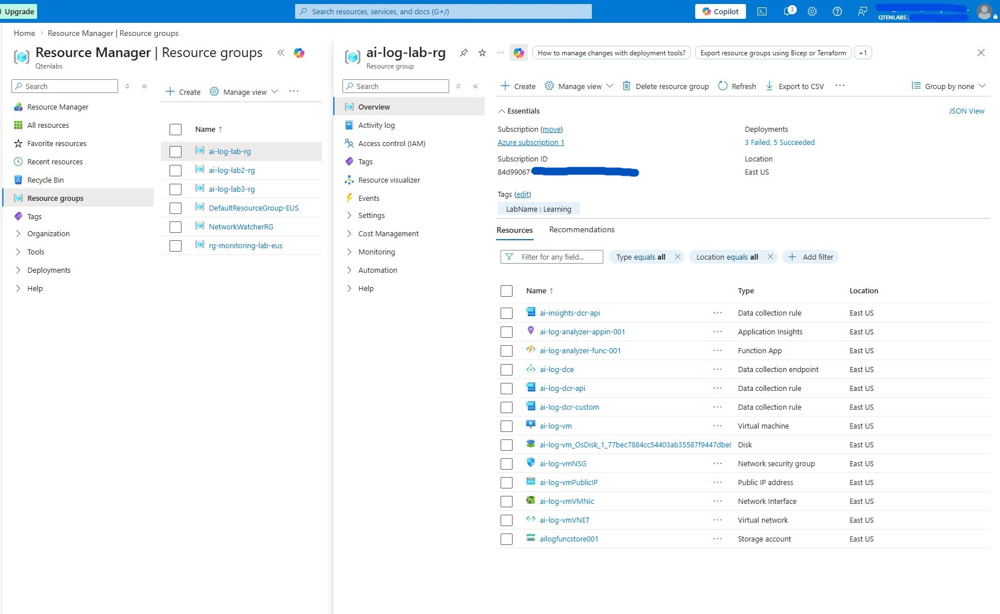

Virtual Machine (Ollama Host)

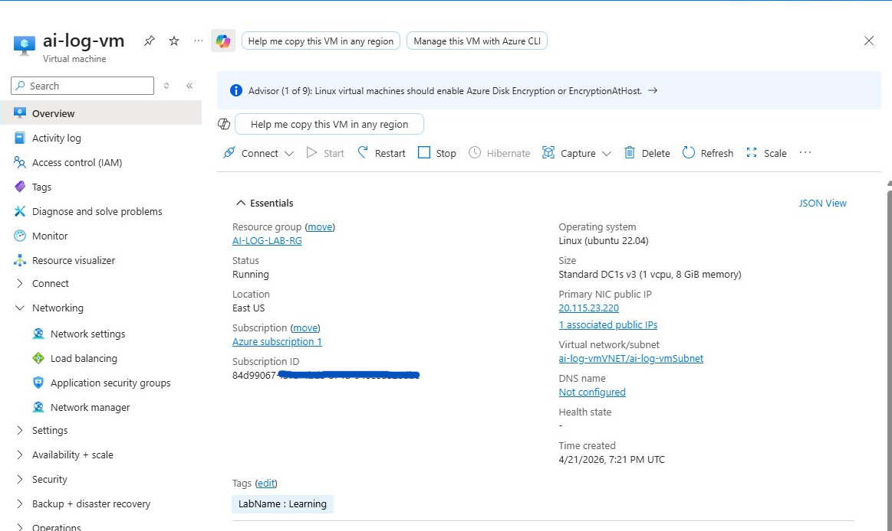

VNet and Subnet Configuration

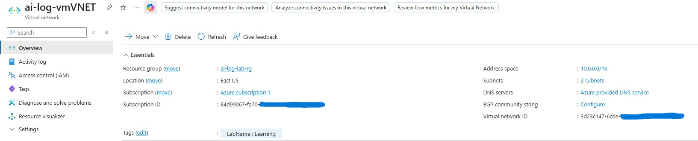  

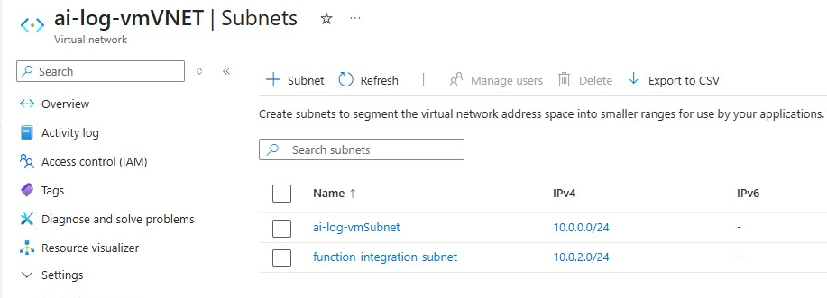

NSG Configuration (Port 11434)

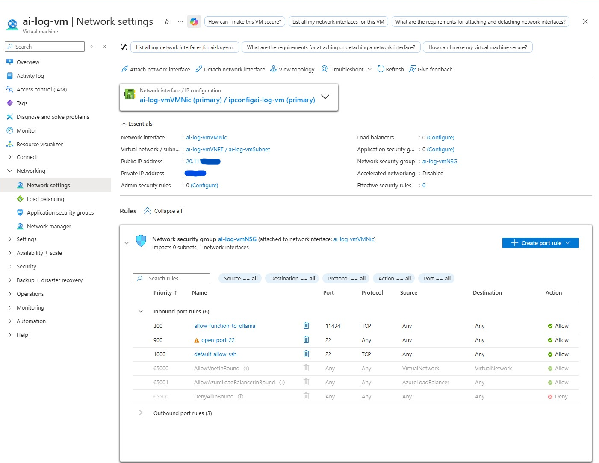

---------------------------------------------------------------------------------------------------------------------------------------------------------------------------------------

🔍 Log Collection (KQL)

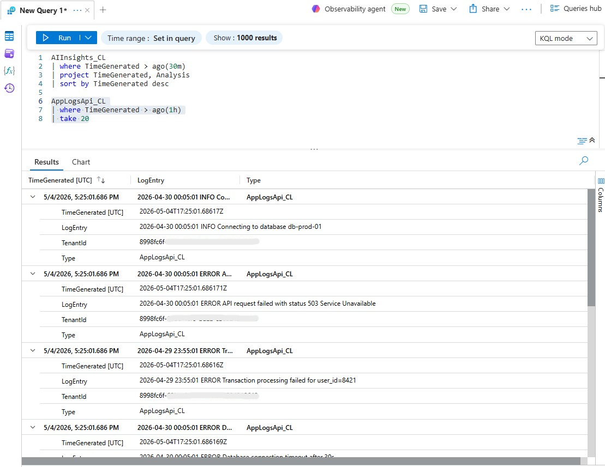

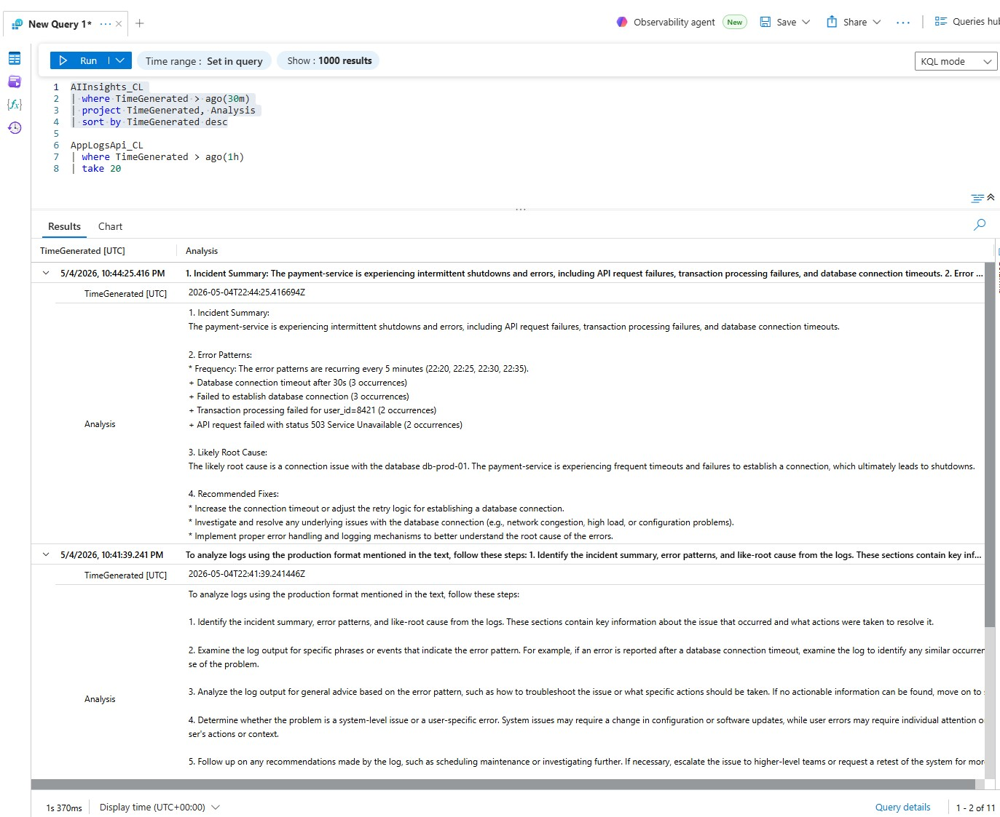

---------------------------------------------------------------------------------------------------------------------------------------------------------------------------------------

🤖 AI Analysis (Ollama)  

Ollama Running

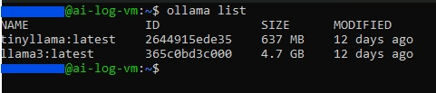

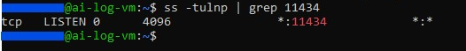

API Test

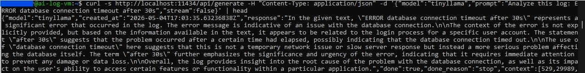

---------------------------------------------------------------------------------------------------------------------------------------------------------------------------------------

🧠 AI Output (Insights Table)

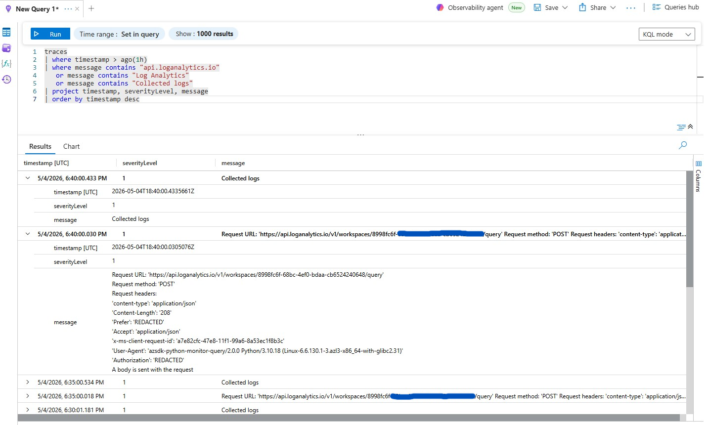  

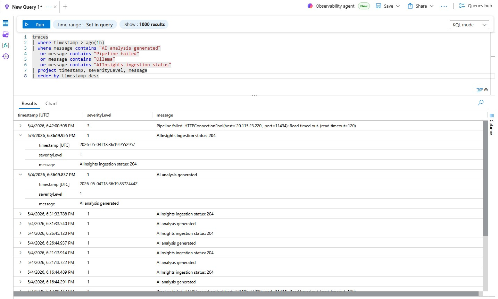  

---------------------------------------------------------------------------------------------------------------------------------------------------------------------------------------

⚙️ Function App Implementation  

Timer Trigger

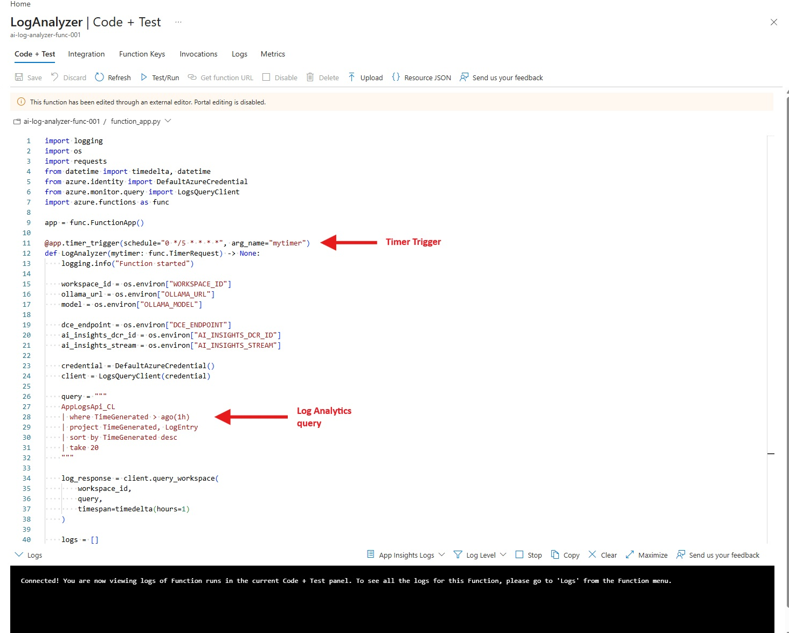

Prompt + Ollama API Call

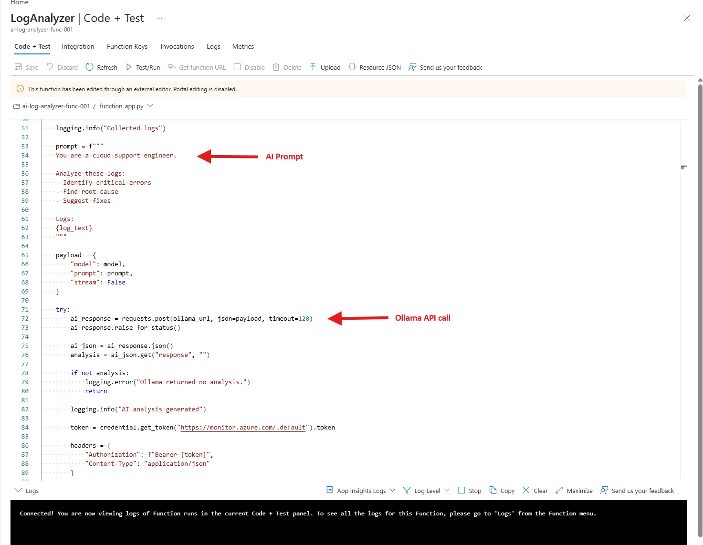

AIInsights Write-back

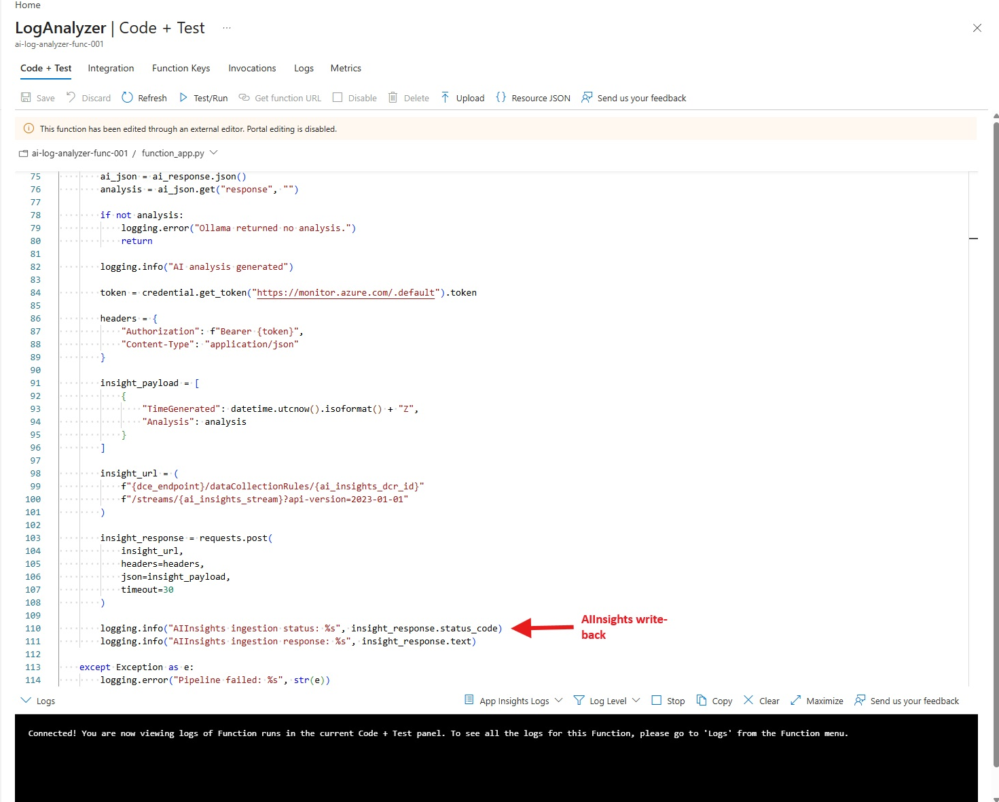

---------------------------------------------------------------------------------------------------------------------------------------------------------------------------------------

🔧 Configuration

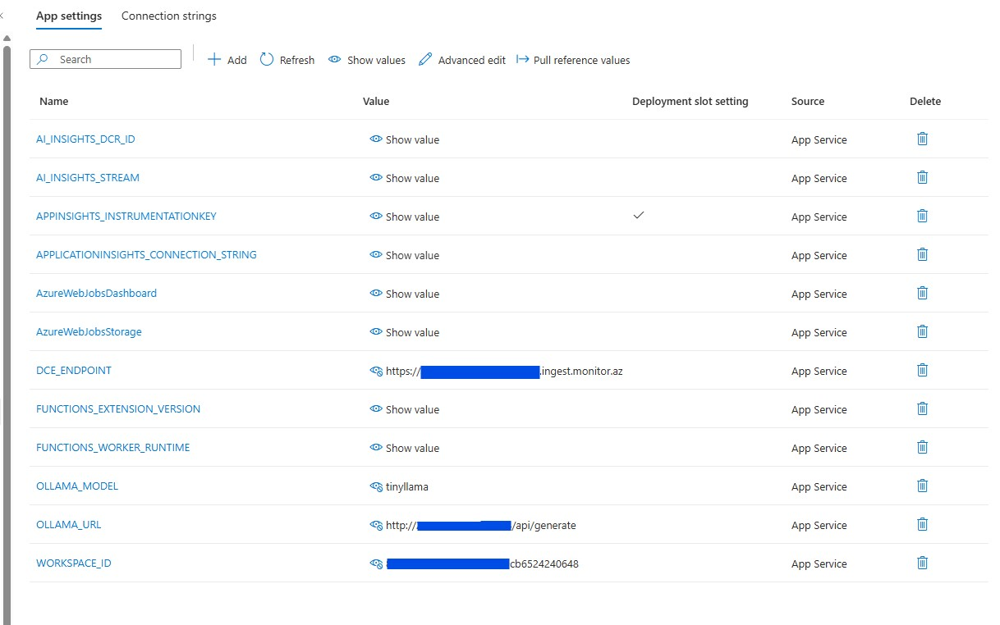

---------------------------------------------------------------------------------------------------------------------------------------------------------------------------------------

🛠 Tech Stack  

- Azure Functions (Python, Timer Trigger)  
- Azure Log Analytics (KQL)  
- Azure Virtual Machine (Ollama – Local LLM)  
- Azure Monitor / Data Collection Rules (DCR/DCE)  
- Python (API integration & automation)

---------------------------------------------------------------------------------------------------------------------------------------------------------------------------------------

🔐 Security (Lab Context)  

- NSG configured to allow port 11434 for Ollama API  
- Public access used temporarily for lab testing  

⚠️ Production Recommendation

- Use VNet integration for Function App  
- Use private endpoints instead of public IP  
- Restrict NSG rules to internal traffic only

---------------------------------------------------------------------------------------------------------------------------------------------------------------------------------------
  
🚧 Challenges & Learnings

- Handling connectivity between Azure Function and VM  
- Managing LLM response latency on limited compute  
- Designing structured AI prompts for consistent output  
- Balancing cost vs performance for cloud resources  

---------------------------------------------------------------------------------------------------------------------------------------------------------------------------------------

🔮 Future Improvements

- Implement private networking (VNet integration)  
- Introduce queue-based processing for scalability  
- Improve prompt engineering for consistency  
- Add dashboards and alerting  

---------------------------------------------------------------------------------------------------------------------------------------------------------------------------------------

📂 Code

Function implementation available here:

function-code/log_analyzer_functionapp.py  

---------------------------------------------------------------------------------------------------------------------------------------------------------------------------------------

👨‍💻 Author

Faiz Qaiser Khan  
Cloud Support Engineer | Azure | Production Operations
